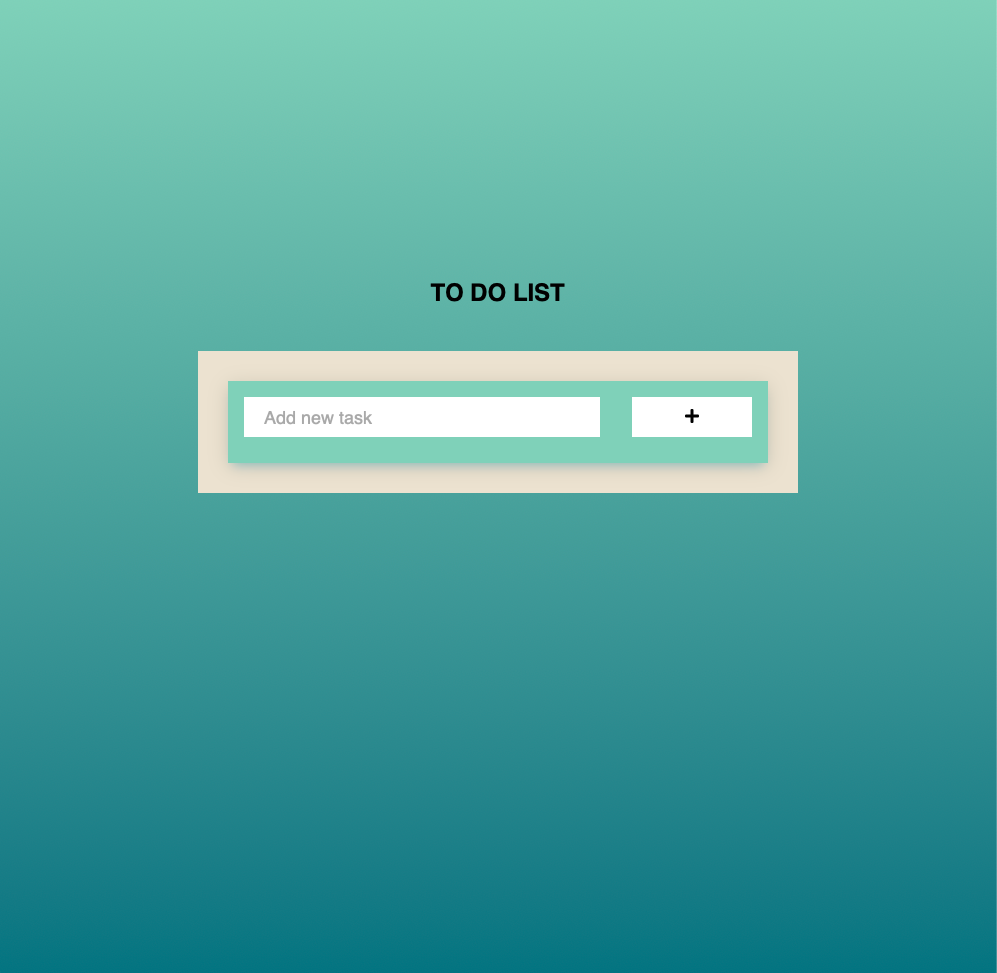

# To-Do list application
## Write a To-Do list application with javascript

The goal of this project is to write a simple To-Do list application in Javascript by following object oriented programming pattern and by using LocalStorage.

The main functional requirements were being able to add a To-Do, mark a To-DO as done, edit a To-Do and delete a To-DO.

The implementation of this website can be viewed [here](https://konstrukteur.github.io/to-do-app-javascript/)

